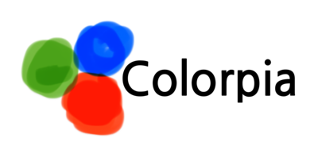

# Installing

```sh
$ npm install colorpia
```

&nbsp;

Once the package is installed, you can import the library using import of require approach.

```js
import { Color } from 'colorpia';
```

```js
const { Color } = require('colorpia');
```

# Features

## Extract value

You can extract specific color value using the methods below.
Using parameter, you can determine color value type.

```ts
.red(type: 'hex' | 'dec');
.green(type: 'hex' | 'dec');
.blue(type: 'hex' | 'dec');
.alpha(type: 'hex' | 'dec');
```

Or, you can obtain all color values using methods below.

```ts
.array(type: 'hex' | 'dec');
.object(type: 'hex' | 'dec');
```

## Convert data

You can convert the format of color data.
For example, you can convert color data starting with '0x' to '#' form, or vise versa.
Or, array of numbers that contains color information to hexadecimal(string type) form.

A numeric conversion converts a hexadecimal rgb value into a decimal; alpha is not included.

```ts
.string(type: '#' | '#a' | '0x' | '0xa');
.number();
```

# Example

Color data should be included in the constructor function's argument.  
And, that data could be string or number in hexadecimal format, or a list of numbers that contains rgb or rgba information.

If the alpha value is not specified, it's automatically set to 100%.  
(However if the format of data is number, you have to specify alpha value)

Rgb, expressed in decimal, ranges from 0 to 255.  
Alpha, expressed in decimal, ranges from 0 to 100.

```js
const red = new Color('#ff0000');
// red: 255, green: 0, blue: 0, alpha: 100(=1.0)

const blue = new Color(0x0000ffff);
// red: 0, green: 0, blue: 255, alpha: 100(=1.0)

const green = new Color([0, 255, 0]);
// red: 0, green: 255, blue: 0, alpha: 100(=1.0)

const yellow = new Color('0xffff00');
// red: 255, green: 255, blue: 0, alpha: 100(=1.0)
```

```js
const red = new Color('#ff000080');
// red: 255, green: 0, blue: 0, alpha: 50(=0.5)

const blue = new Color(0x0000ffcc);
// red: 0, green: 0, blue: 255, alpha: 80(=0.8)

const green = new Color([0, 255, 0, 20]);
// red: 0, green: 255, blue: 0, alpha: 20(=0.2)

const yellow = new Color('0xffff00ff');
// red: 255, green: 255, blue: 0, alpha: 100(=1.0)
```

&nbsp;

It returns a decimal or hexadecimal value in form of each rgba element or array or object.

```js
const color = new Color('#ff0000');

color.red('hex'); // 'ff'
color.red('dec'); // 255

color.green('hex'); // '00'
color.green('dec'); // 0

color.blue('hex'); // '00'
color.blue('dec'); // 0

color.alpha('hex'); // 'ff'
color.alpha('dec'); // 100

color.object('hex');
// { red: 'ff', green: '00', blue: '00', alpha: 'ff' }

color.object('dec');
// { red: 255, green: 0, blue: 0, alpha: 100 }

color.array('hex');
// [ 'ff', '00', '00', 'ff' ]

color.array('dec');
// [ 255, 0, 0, 100 ]
```

```js
const color = new Color(0xff00ff80);

color.red('hex'); // 'ff'
color.red('dec'); // 255

color.green('hex'); // '00'
color.green('dec'); // 0

color.blue('hex'); // 'ff'
color.blue('dec'); // 255

color.alpha('hex'); // '80'
color.alpha('dec'); // 50

color.object('hex');
// { red: 'ff', green: '00', blue: 'ff', alpha: '80' }

color.object('dec');
// { red: 255, green: 0, blue: 255, alpha: 50 }

color.array('hex');
// [ 'ff', '00', 'ff', '80' ]

color.array('dec');
// [ 255, 0, 255, 50 ]
```

```js
const color = new Color('0xffffff80');

color.red('hex'); // 'ff'
color.red('dec'); // 255

color.green('hex'); // 'ff'
color.green('dec'); // 255

color.blue('hex'); // 'ff'
color.blue('dec'); // 255

color.alpha('hex'); // '80'
color.alpha('dec'); // 50

color.object('hex');
// { red: 'ff', green: 'ff', blue: 'ff', alpha: '80' }

color.object('dec');
// { red: 255, green: 255, blue: 255, alpha: 50 }

color.array('hex');
// [ 'ff', 'ff', 'ff', '80' ]

color.array('dec');
// [ 255, 255, 255, 50 ]
```

```js
const color = new Color([214, 32, 56]);

color.red('hex'); // 'd6'
color.red('dec'); // 214

color.green('hex'); // '20'
color.green('dec'); // 32

color.blue('hex'); // '38'
color.blue('dec'); // 56

color.alpha('hex'); // 'ff'
color.alpha('dec'); // 100

color.object('hex');
// { red: 'd6', green: '20', blue: '38', alpha: 'ff' }

color.object('dec');
// { red: 214, green: 32, blue: 56, alpha: 100 }

color.array('hex');
// [ 'd6', '20', '38', 'ff' ]

color.array('dec');
// [ 214, 32, 56, 100 ]
```

&nbsp;

You can also convert it to another type.

```js
const color = new Color('0xffaabb');

color.string('#'); // #ffaabb
color.string('#a'); // #ffaabbff
color.string('0x'); // 0xffaabb
color.string('0xa'); // 0xffaabbff

color.number(); // 16755387
```

```js
const color = new Color(0x00aabbff);

color.string('#'); // #00aabb
color.string('#a'); // #00aabbff
color.string('0x'); // 0x00aabb
color.string('0xa'); // 0x00aabbff

color.number(); // 43707
```

```js
const color = new Color('#ff00bbab');

color.string('#'); // #ff00bb
color.string('#a'); // #ff00bbab
color.string('0x'); // 0xff00bb
color.string('0xa'); // 0xff00bbab

color.number(); // 16711867
```

```js
const color = new Color([255, 170, 187, 0]);

color.string('#'); // #ffaabb
color.string('#a'); // #ffaabb00
color.string('0x'); // 0xffaabb
color.string('0xa'); // 0xffaabb00

color.number(); // 16755387
```

# License

MIT
